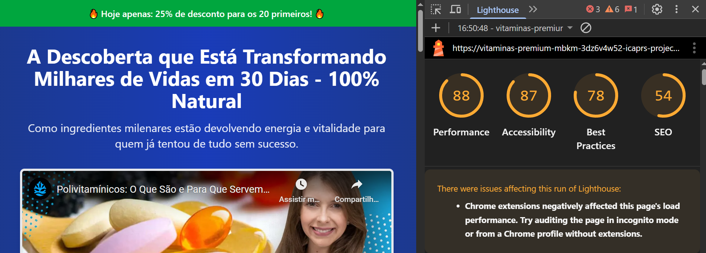

# Página VSL para Venda de Vitaminas premium

## 📜 Descrição do Projeto

Este projeto consiste no desenvolvimento de uma **página VSL (Video Sales Letter)** focada na venda de multivitaminicos. O objetivo principal foi criar uma landing page responsiva e otimizada para alta conversão, demonstrando proficiência em tecnologias modernas de front-end, além de uma compreensão prática dos princípios de marketing digital aplicados ao desenvolvimento web. A demanda simula um cenário real de trabalho em uma equipe de marketing digital.

---

## 🛠️ Tecnologias Utilizadas

- **Framework:** React JS (Vite)
- **Estilização:** Tailwind CSS

---

## ✨ Funcionalidades

- **Design Responsivo:** A página se adapta perfeitamente a qualquer dispositivo, seja desktop, tablet ou smartphone, garantindo uma experiência de usuário consistente e fluida.
- **Vídeo Integrado:** Elemento central da página, o vídeo (VSL) é o foco para apresentar o produto e suas vantagens.
- **Botão de Chamada para Ação (CTA):** Botão estratégico e visualmente destacado que guia o usuário para a conversão.
- **Seções de Prova Social:** Inclusão de depoimentos de clientes e selos de garantia para construir confiança e credibilidade.
- **Design Focado em Conversão:** A estrutura da página foi pensada para seguir um funil de vendas, direcionando o visitante para a ação desejada.

---

## 🚀 Como Rodar o Projeto

Para visualizar e testar o projeto localmente, siga os passos abaixo:

1.  **Clone este repositório:**

    ```bash
    git clone [LINK_DO_SEU_REPOSITORIO]
    ```

2.  **Navegue até o diretório do projeto:**

    ```bash
    cd [NOME_DO_SEU_PROJETO]
    ```

3.  **Instale as dependências:**

    ```bash
    npm install
    ```

4.  **Inicie o servidor de desenvolvimento:**
    ```bash
    npm run dev
    ```

A aplicação estará disponível em `http://localhost:5173/`.

---

## 📂 Estrutura de Arquivos

- `src/components/`: Componentes reutilizáveis da interface, como o CTA, seções de depoimentos, etc.
- `src/App.jsx`: Componente principal que orquestra as diferentes paginas.
- `src/pages/LandingPage`: Pagina para principal para atrair clientes.
- `src/pages/CheckoutPage`: Pagina para simular checkout.
- `src/pages/LandingPage`: Pagina com foco em agradecer e mostrar os UTMs.
- `src/index.css`: Arquivo principal de estilos, onde o Tailwind CSS é configurado.

---

## Lighthouse



A imagem acima mostra a performance obtida no Lighthouse, com os seguintes resultados:

- **Performance:** 88
- **Accessibility:** 87
- **Best Practices:** 78
- **SEO:** 54

---

## ✍️ Autor

**icaPR**

Este projeto serve para demonstra a capacidade de traduzir requisitos de negócios e marketing em soluções técnicas eficientes e elegantes, usando as ferramentas certas para o trabalho.
